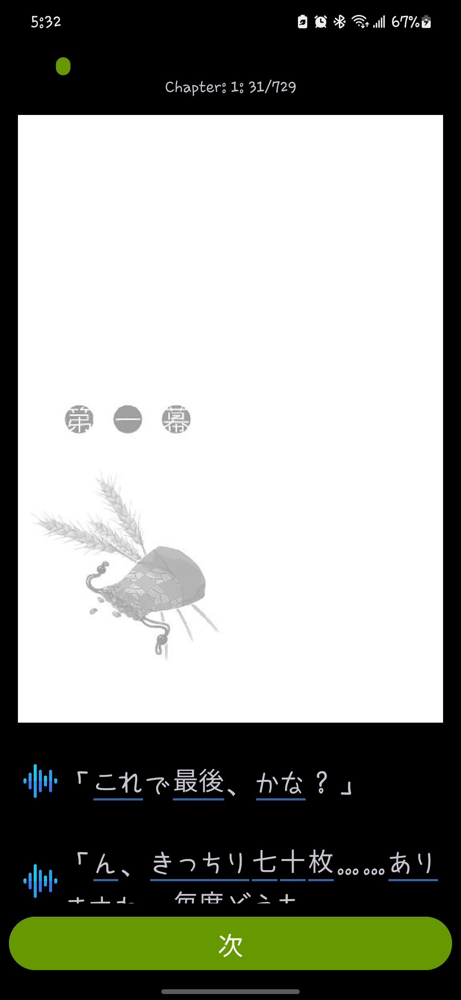
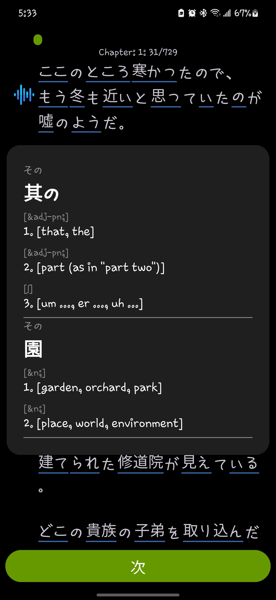
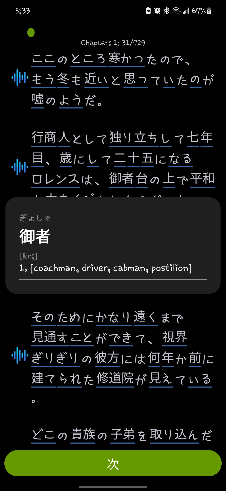
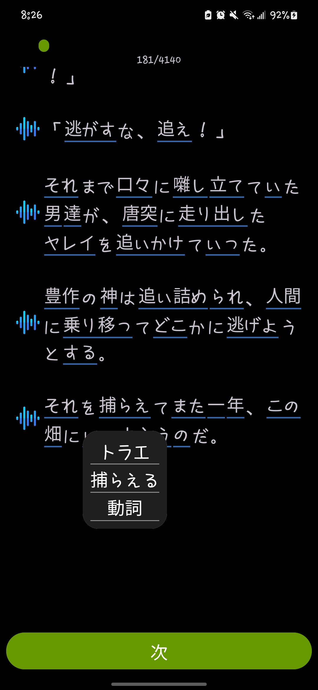

# Scribe Reader

## What is this?
This is an app I'm making to help advanced langauge learners consume native Japanese books and content. 
This takes heavy inspiration from Duolingo with it's gamified quizes throughout the reading.

### Core Features
- [x] Loading .epub file in app 
- [x] In app parsing of .epub file removing unneccessary text, and splitting into chapters
- [x] In app tokenization of Japanese text, getting part of speech and base word
- [ ] Basic TTS to read out the story
- [ ] SRS/Flash card system
- [ ] Add cards to review when definition/reading is viewed during story
      
      
# Start of Chapter 1 of a certain light novel

# Example of UI element for viewing the definition of a word with ambiguity

# Example of UI Element for viewing the definition of a word without ambiguity

# Example of UI Element for viewing the reading, dictionary form, and part of speech of a word

## As of initial commit to this repository, epubs are no longer processed in another application and retrieved by the app. Now all is done in the app.
